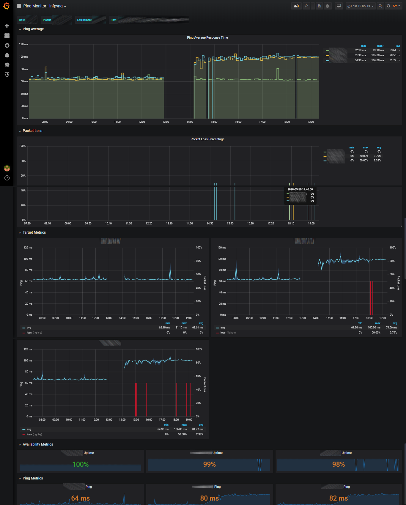

# Infpyng

## Introduction

***Infpyng*** is a powerful python script which utilize [fping](https://fping.org/) to probe endpoint through ICMP and parsing the output to [Influxdb](https://github.com/influxdata/influxdb). The result can then be visualize through [Grafana](https://grafana.com/) with ease.
- ***Infpyng*** is perhaps your alternative to SmokePing
- You can add ***dynamic*** hosts without restarting script
- Custom ***Polling*** time configuration
- ***Low resource*** consumption

**Benchmark**

These tests were performed from a FreeBSD OS with 1 CPU and 2 GB of memory
```
IP to ping   : 474          | 1299        | 2653        | 3388
IP reachable : 454          | 1197        | 2552        | 3262
Finished in  : 11 seconds   | 13 seconds  | 28 seconds  | 32 seconds
```

**Requirements**
- Python 3.6.x or newer
- fping 4.x
- Grafana 6.7.x
- Influxdb 1.8.x

**Screenshots**


## Installation
**Download infpyng project and place it inside /usr/local/bin/**
```
# cd /usr/local/bin/
# git clone https://github.com/oijkn/infpyng.git
# pip install -r requirements.txt
```

## Usage
**1. Ensure Correct Permission on \*.py files**
```
# chmod -R +x /usr/local/bin/infpyng/*.py
```

**2. Configure global settings in /usr/local/bin/infpyng/config/config.toml**
```toml
[config]
name = "Infpyng Config"
description = "Infpyng can ping multiple hosts at once and write data to InfluxDB"
version = "0.0.6"


[logging]
## Set path for the log file
path = "/var/log/infpyng.log"


[influxdb]
## Hostname to connect to InfluxDB, defaults to 'localhost'
hostname = 'localhost'

## Port to connect to InfluxDB, defaults to 8086
port = 8086

## Database name to connect to InfluxDB
dbname = 'infpyng'


[options]
## Number of request packets to send to each target
count = 5

## The minimum amount of time in milliseconds between sending a ping packet
## to any target (default is 10ms, minimum is 1ms)
# interval = 100

## this parameter sets the time in milliseconds that fping waits between
## successive packets to an individual target. Default is 1000 and minimum is 10.
## timeout (-t) value must be smaller or equal than period (-p) produces
period = 1000

## The time to wait for a ping response in milliseconds
## the default timeout is 500ms
timeout = 1000

## Backoff factor, this parameter is the value by which the wait time (-t) is
## multiplied on each successive request; it must be entered as a
## floating-point number (x.y). The default is 1.5.
backoff = 1.0

## Retry limit (default 3). This is the number of times an attempt at pinging
## a target will be made, not including the first try.
retry = 2

## Set the typ of service flag ( TOS ). N can be either decimal or
## hexadecimal (0xh) format.
tos = 0

```

**3. Configure host(s) file in /usr/local/bin/infpyng/config/hosts.toml**
######You can use several configuration files for the hosts by respecting the structure as follows
```toml
[[targets]]
  hosts = ['8.8.8.8', '8.8.4.4']
  [targets.tags]
     country = 'us'
     server = 'dns'

[[targets]]
  hosts = ['google.fr']
  [targets.tags]
     country = 'fr'
     server = 'french'

[[targets]]
  hosts = ['amazon.es']
  [targets.tags]
     country = 'es'
     server = 'spain'

[[targets]]
  hosts = ['facebook.de']
  [targets.tags]
     country = 'de'
     server = 'germany'
```

## Logger
```
2020-05-22 14:12:10 root INFO :: Targets to ping: 57
2020-05-22 14:12:10 root INFO :: Multiprocessing: 40
2020-05-22 14:12:10 root INFO :: Buckets: 1
2020-05-22 14:12:10 root INFO :: Starting Infpyng Multiprocessing v0.0.6
2020-05-22 14:12:18 root INFO :: Targets alive: 55
2020-05-22 14:12:18 root INFO :: Targets unreachable: 2
2020-05-22 14:12:18 root WARNING no_host.xxx
2020-05-22 14:12:18 root WARNING other_host.yyy
2020-05-22 14:12:18 root INFO :: Writing points to InfluxDB successfully
2020-05-22 14:12:18 root INFO :: Finished in: 8.28 seconds
```

## Metrics

- infpyng
  - tags:
    - host (host name)
    - target
  - fields:
    - packets_transmitted (integer)
    - packets_received (integer)
    - percent_packets_loss (float)
    - average_response_ms (float)
    - minimum_response_ms (float)
    - maximum_response_ms (float)

### Example Output
```
infpyng,country=de,host=TIG,server=germany,target=facebook.de average_response_ms=21.2,maximum_response_ms=21.8,minimum_response_ms=20.7,packets_received=2i,packets_transmitted=2i,percent_packet_loss=0i 1589193188000000000
```

## Github contributors lib
- [High performance ping tool](https://github.com/schweikert/fping)
- [Python lib for TOML](https://github.com/uiri/toml)
- [Python client for InfluxDB](https://github.com/influxdata/influxdb-python)
- [Powerful polling utility in Python](https://github.com/ddmee/polling2)

## Licensing

This project is released under the terms of the MIT Open Source License. View LICENSE file for more information.

